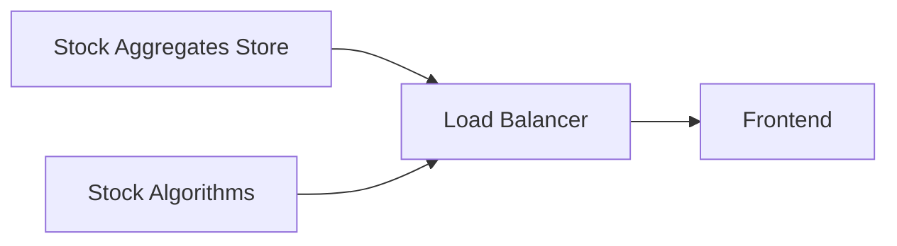

# The Callery Pear
Callery Pears is a web platform hosted at [thecallerypear.com](http://www.thecallerypear.com/), and with the long-term goal of providing an easy way to simulate pair trading strategies. 

Please note that  this project is still very early on in its development and has a lot of quirks that will be fixed in future commits.  
Just to name a few:
- Docker volumes instead of copying over the sqlite3 database
- Orchestration Service like Kubernetes or Docker Swarm
- Taking into consideration missing data points when performing tests

## Architecture
The Callery Pear backend consists of a dockerized microservice backend for portability and easy deployment. The microservices are connected via gRPC and connect to the frontend through a RESTful API. 

## Setup
```bash
git clone https://github.com/J3r0m3L/Callery.git
cd Callery 
```

### Retrieve Data
Ensure you have Python 3 and Pip installed.
```bash
cd python
python3 -m venv venv
source venv/bin/activate
pip install -r requirements.txt
```
In the `populateDatabase` folder there is a `StoreStockData.py` file. This file retrieves stocks information from polygon.io and stores it in a local sqlite3 database. Create a polygon.io account and store the API key in a `.env` file as such.
```
POLYGON_IO_API_KEY=<API KEY>
```
Modify the stocks and timestamps to personal needs.
```bash
python3 StoreStockData.py
mv StockData.db ../c++/stockAggregatesStore
```
### Start Services
Ensure you have Docker installed. In the base directory, start the Stock Aggregates Store service.
```bash
./run-callery.sh sas-only
```
In a new terminal tab, start the Stock Algorithms service.
```bash
./run-callery.sh sa-only
```
In a new terminal tab, start the Load Balancer service.
```bash
./run-callery.sh lb-only
```
In a new terminal tab, start the Frontend service.
```bash
cd javascript
npm ci
npm start
```
Congratulations! You should have an instance of Callery Pears running on your local machine. 
## Troubleshooting
This project is still very early on in its development. Here are some quirks that you may have encountered and some quick solutions. 

### Microservice Backend Interconnection Failure
The microservices can't find each other. This could result in a 404 error on the Load Balancer log. This is because the docker containers are connected via a docker network and the network values are hard-coded. **The first solution** is to delete your remove all Callery Pear project containers and restart them with `run-callery.sh` in this order: Stock Aggregates Store, Stock Algorithms, Load Balancer. **The second solution** you can inspect the Callery-Pear network and modify the hard-coded addresses in Load Balancer. 